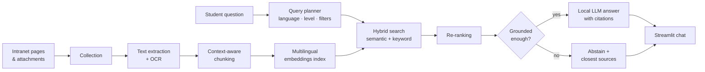

# 🎓 Inside Assistant — a grounded AI assistant for a school intranet

> Students ask questions in plain French or English about courses, programmes, rules and school life — the assistant answers **with its sources**, and says *"I don't know"* instead of making things up.

**Albert School · *Prompt Engineering & Git* course · September 2026 · team of 4 (Ema, Lior, Cerise, Aymeric)**

> 🔒 **The source code is private.** This project is being developed further as a product; this page presents what it does and how it was built. A live demo is available on request.

---

## The problem
A school intranet holds hundreds of pages and attachments — course catalogue, prerequisites, ECTS, attendance and catch-up exam rules, wiki guides. Finding one precise answer means clicking through menus and PDFs. A generic chatbot is worse: it answers confidently even when it is wrong.

## What the assistant does
- 💬 **Conversational Q&A** in French or English, with follow-up questions understood in context.
- 📎 **Every answer is sourced** — numbered citations linking back to the exact intranet page or document.
- 🛑 **Abstains when the intranet doesn't say** — and lists the closest relevant sources instead of inventing an answer.
- 🎯 **Understands school vocabulary** — "second year", course levels, semesters and programmes are turned into precise filters.
- 🔍 **Transparent** — confidence status, cited passages and an optional debug panel in the interface.

**Examples of questions it handles**
| Question | Expected behaviour |
|---|---|
| *What are the prerequisites of Machine Learning III?* | Answer + citation of the course sheet |
| *I missed 4 hours of a B1 course this semester — do I go to catch-up exams?* | Combines attendance policy + catch-up rules, cited |
| *What is the tuition price of a university on Jupiter?* | Clear abstention, no hallucination |

## How it works

| Stage | What we built |
|---|---|
| **Collection & extraction** | Crawling of intranet pages and attachments, native text extraction with an OCR fallback, provenance kept for every document |
| **Chunking** | ~4,700 passages, each carrying its document context (course, level, place in the programme); course catalogue split into course sheets; duplicates merged; personal pages excluded |
| **Indexing** | Multilingual embeddings in a persistent vector store, incremental updates |
| **Retrieval** | Query planning, hybrid semantic + keyword search, cross-encoder re-ranking, diversity |
| **Answering** | Local LLM by default (data stays on the machine), citation checks, abstention policy |
| **Quality** | Evaluation set of ~75 FR/EN questions incl. unanswerable ones, dev/test split, LLM-as-a-judge for faithfulness & relevance, full tracing of every LLM call |

**Engineering rule we held ourselves to:** no hard-coded keywords or special cases to make a question pass — every fix goes through the data, the model or a setting measured on the dev set and verified on the test set.

## Privacy by design
- Runs **locally** by default — no intranet content leaves the machine.
- Personal pages (directory, personal timetable) are excluded before indexing.
- Collected data, sessions and indexes are never versioned.

## Stack
`Python 3.11` `OCR` `SentenceTransformers` `bge-m3` `ChromaDB` `hybrid search (BM25)` `cross-encoder re-ranking` `Ollama` `Langfuse` `Streamlit` `unit tests` `Git workflow`

---

### 🇫🇷 En bref
Assistant IA pour l'intranet d'Albert School (cours *Prompt Engineering & Git*, sept. 2026, équipe de 4). Les étudiants posent leurs questions en français ou en anglais ; l'assistant répond **avec ses sources** et s'abstient quand l'intranet ne contient pas la réponse. Collecte, OCR, découpage contextualisé, index multilingue, recherche hybride avec reranking, LLM local et évaluation rigoureuse. **Code source privé** — projet en cours de développement ; démo sur demande.
